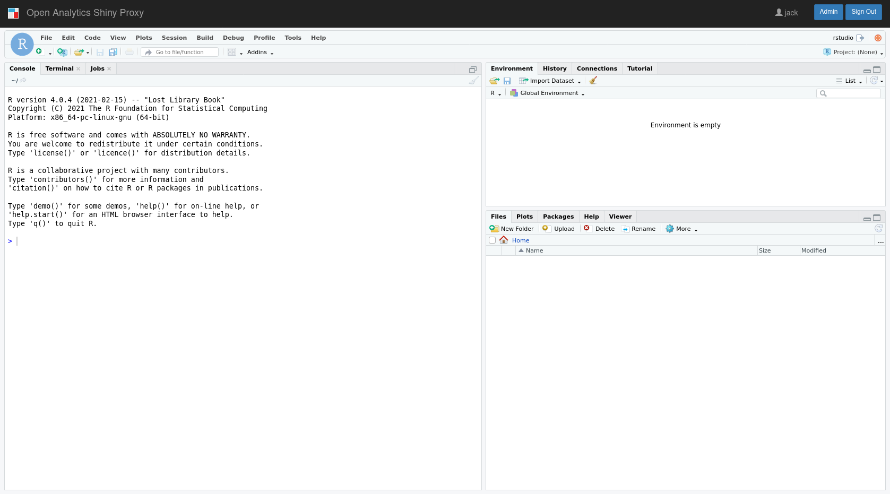

# Running RStudio inside ShinyProxy

**RStudio version**: 1.4.1106
**R Version**: 4.0.4

[Click here for a version using R 3.6.0](https://github.com/openanalytics/shinyproxy-rstudio-ide-demo/tree/1.2.1335__3.6.0)

[Screenshot](#screenshot)

This repository explains how to run RStudio in ShinyProxy.
The latest version of RStudio requires at least ShinyProxy 2.5.0.

## Building the Docker image

To pull the image made in this repository from Docker Hub, use

```bash
sudo docker pull openanalytics/shinyproxy-rstudio-ide-demo:1.4.1106__4.0.4
```

The relevant Docker Hub repository can be found at [https://hub.docker.com/r/openanalytics/shinyproxy-rstudio-ide-demo](https://hub.docker.com/r/openanalytics/shinyproxy-rstudio-ide-demo)

To build the image from the Dockerfile, navigate into the root directory of this repository and run

```bash
sudo docker build -t openanalytics/shinyproxy-rstudio-ide-demo:1.4.1106__4.0.4 .
```

## ShinyProxy Configuration

For deployment on ShinyProxy the environment variables `DISABLE_AUTH` must be set to `true` and `WWW_ROOT_PATH` to the path of the application, finally the port of the container must be configured to 8787, e.g.:

```yaml
specs:
  - id: rstudio
    container-image: openanalytics/shinyproxy-rstudio-ide-demo:1.4.1106__4.0.4
    container-env:
      DISABLE_AUTH: true
      # Use the following line when using ShinyProxy 2.6.0 or later
      WWW_ROOT_PATH: "#{proxy.getRuntimeValue('SHINYPROXY_PUBLIC_PATH')}"
      # Use the following line when using ShinyProxy 2.5.0
      # WWW_ROOT_PATH: "#{proxySpec.containerSpecs[0].env.get('SHINYPROXY_PUBLIC_PATH')}"
    port: 8787
```

Another useful option is to mount volume per user, e.g.:

```yaml
    container-volumes: [ "/tmp/#{proxy.userId}:/home/rstudio" ]
```

Here `/home/rstudio` is used inside the container since "rstudio" is the default username in `rocker/rstudio` image.
If desired, this can be changed by setting `USER` environment variable in the application specs as follows:

```yaml
specs:
  - id: rstudio
    container-image: openanalytics/shinyproxy-rstudio-ide-demo:1.4.1106__4.0.4
    container-env:
      DISABLE_AUTH: true
      USER: "#{proxy.userId}"
      # Use the following line when using ShinyProxy 2.6.0 or later
      WWW_ROOT_PATH: "#{proxy.getRuntimeValue('SHINYPROXY_PUBLIC_PATH')}"
      # Use the following line when using ShinyProxy 2.5.0
      # WWW_ROOT_PATH: "#{proxySpec.containerSpecs[0].env.get('SHINYPROXY_PUBLIC_PATH')}"
    port: 8787
    container-volumes: [ "/tmp/#{proxy.userId}:/home/#{proxy.userId}" ]
```

## Screenshot



**(c) Copyright Open Analytics NV, 2019-2021.**
